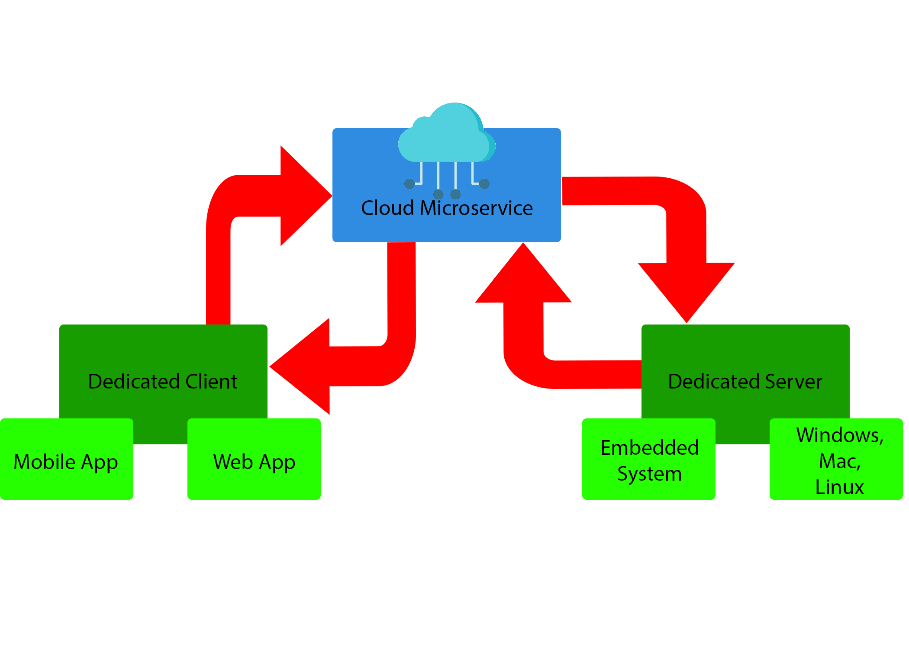
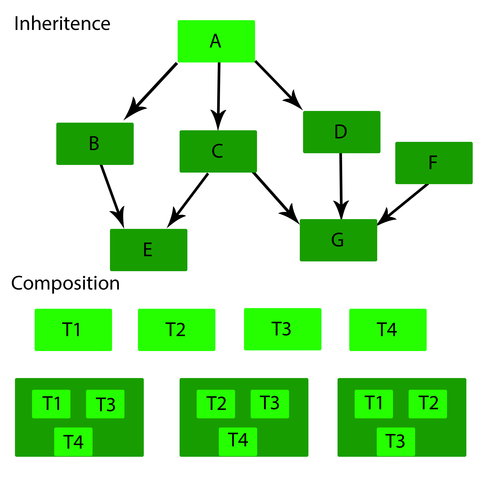

# Philosophy

The idea behind a new language like this is to take the philosophy of Kotlin/Multiplatform for enterprise applications and applying it to a very particular type of enterprise software: consumer driven automated software.

## Consumer Driven Automation
The idea behind consumer driven automation is to take several different complex tasks, applying an automation software to them, but allowing them to work together with a cloud microservice that acts as a middle man between the automated tasks and a dedicated client, aka, the user interface. This allows a user to easily manage several different complex automated tasks through a user interface.

The dedicated client is the user interface, whether that would be a mobile app or a web app. This then updates its interface with data retrieved from the cloud. The cloud contains data that is updated by the dedicated server. The dedicated server is ran either on an embedded system such as a microprocessor like Raspberry Pi, or on a standard machine, like a windows or linux machine. The dedicated client may also have the ability to manipulate data stored on the cloud or even interface with the dedicated client via the cloud microservice. They all then work together as cousin modules to compose the entire software.

## Kotlin/Multiplatform and Enterprise Applications
**Now why not just use Kotlin/Multiplatform to achieve a cleaner workflow? Besides, isn't this exactly what Kotlin/MP is being made for?**

No, not exactly. The problem here is the specific division of modules and the environments required to develop, test, and deploy these modules. You would still have to setup a complicated development environment for your particular needs. You could just develop tools to enhance your deployment and testing abilities but that just might complicate things further, or even restrict you to using a very particular workflow.

If I use Kotlin/MP for organizing my dedicated server, my automation modules, my cloud microservice, and my dedicated clients, I would still need to find some extra tools to help me immediately deploy to my cloud, my clients (like android and ios which emulators do exist for a reason), and my dedicated servers (like a raspberry pi, or some other machine perhaps on my local network or even a remote network). This could make my workflow rather rather complicated.

Another problem is that Kotlin isn't exactly embedded systems friendly. Sure, you *could* use Kotlin/Native for it, but Kotlin doesn't exactly give you the tools you need to write low level, embedded systems friendly code the way Rust does. Rust provides composition rather than inheritence for its data structures, and that is really useful in a situation where I am limited in my resources. Not only that, but Kotlin is not exactly *automation friendly either*. Python is currently the automation leading programming language. It's also dynamically typed so you can write your code in a way that doesn't restrict you to creating several wrapper classes to represent some kind of resource, nor does it restrict you to generic programming, nor does it force you to write boilerplate code, such as several extraneous wrapper functions.

Take RESTful APIs for example. In Python, when you use an API like google's client api for talking to their servers, you call upon an API object some functions that aren't actually defined in the library. It's defined on the server. The way this works is that it takes a document that is sent by a server containing details on a particular resource specified in the GET/POST request. In the case of the Youtube API, you have the ability to GET a resource containing data about all the videos for the given account. You can also specify parameters for these details. Generally, any language can do this but Python is especially good at this because of its dynamic typing and general flexibility. Being able to modify the state of a Resource object at runtime, state details such as methods that can be called and what arguments can be supplied, is really great for writing very simple and clean code that interacts with a REST API, especially if you're trying to automate some kind of task.

Another thing that is lacking in Kotlin is very simple data processing code writing techniques. Kotlin does have a lot of functional style functions in the standard library by providing scope functions and internal dsl's, but the problem then is boilerplate code. Python eliminates this by having the language designed for data processing. It was actually originally designed for writing shell and os tools. It is now being applied in several areas where it may not actually do so well, such as being used for web frameworks. While Python Django is pretty good, Ruby on Rails beats it because of the object oriented features that Ruby provides and Python lacks. This is one of the problems with sticking to a language like Python for writing all of our code in one project with several cousin modules, you'll still be missing a lot of powerful tools and features that Ruby and Kotlin provide. However, using only Kotlin for all of the modules means you'd be sacrificing the usefulness of the dynamic typing and flexibility of Python and Ruby.

**So why not just use Ruby?** 
Ruby is interpreted, and slowly at that. Not only that but making the enterprise application, the dedicated client in particular, is still best done with a statically typed language like Kotlin, which is why Kotlin is statically typed. Well, originally, Kotlin was made for Java interop, but now the static typing is being kept. That's also why Android apps are using Java and Kotlin (statically typed languages) and iOS uses Swift (a statically typed language). Also, Ruby for embedded systems programming is, as I would say, *no bueno*, and at this point, not even possible. Rust is currently best for embedded systems programming. However, when it comes to automated software on an embedded system like Raspberry Pi, Rust is also *no bueno*. Rust enforces a borrowing and ownership memory management system and may actually set you back a LOT with general workflow and productivity when all you wanna do is writing some automation.

So why don't we have a language that is statically typed by default, but allows dynamic typing for the above reasons. Not only that but the typing system must allow you to define inherited types while not being restricted to type inheritence. It must also allow you to have *type composition*.

**Why does it matter if types are inherited or composed?** 
Memory. That is why. The below diagram shows the main difference between inheritence and composition in a type system.

With inheritence, classes are essentially nested within each other. Well, not really nested, but for argument's sake, let's roll with it. Inheritence forces the resource, in memory, to take on all the members, all the data, all the properties, and all the metadata of its supertypes. In memory, that could be absolutely huge. Not only that but in order to invoke an object's constructor, all the super constructors must be invoked as well. This could actually be detrimental in a situation where you don't have as much power as an Intel or AMD processor. Nor do you have the affordability of your average hardware. This is why languages like Rust were designed the way they are. To have an ECS (Entity Component System) type system instead of a CIS (Class Inheritence System).

**So what you're saying is, we should forget about CIS?** 
Absolutely not. CIS is an amazing technique for designing and scaling your types according to your need. It's all about context. In a situation where you're designing a mobile app, you have LOTS of leg room. More leg room than an airplane seat. This would be good to have a statically typed CIS type system. However, in an embedded systems situation like a microprocessor, you don't have a lot of leg room. The most efficient type system is ECS. So why don't we have both? Why don't we really think about how we could merge the two type systems into one language? Well I explain this solution in much of my other design documents, especially [this one](ECS_VS_CIS.md), or even these documents:

1. [Data Structures](DATA_STRUCTURES.md)
2. [Traits](TRAITS.md)
3. [Classes](CLASSES.md)
4. [Interfaces](INTERFACES.md)
5. [Duck Typing](DUCK_TYPING.md)

**What about that *interactive garbage collector* you had mentioned** 
What I meant by an *interactive garbage collector* is a means of being able to tell an automatic memory manager what to do with a particular resource, without being forced to give away all the details. It's a smart memory manager. By either specifying a pass by reference vs pass by value situation, or even specifying that you want to take complete control over a resource. And no, I'm not talking about pointers. References? Well, yes (technically, pointers and references are the same thing), but not in the same way that Rust or C++ do it. A way to build it into the language, similar to how C# has the 
`ref` keyword. Elaboration can be found in the [memory management doc](MEMORY_MANAGEMENT.md).